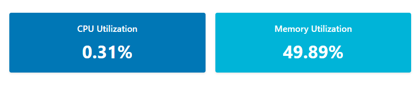

# Realtime Dashboard for Local OS Metrics
This is a web application that displays real-time system metrics for your local operating system, such as CPU and memory utilization. The application is built using React and Node.js, and uses the os-utils library to retrieve system metrics.

# Installation
Clone this repository to your local machine using git clone https://github.com/your-username/realtime-dashboard-local-os-metrics.git.
Navigate to the backend directory and run npm install to install the required Node.js packages.
Navigate to the my-dashboard directory and run npm install to install the required React packages.

# Usage
To start the Node.js server, navigate to the backend directory and run npm start. This will start the server on http://localhost:3001.
To start the React application, navigate to the my-dashboard directory and run npm start. This will start the application on http://localhost:3000.
Open your web browser and go to http://localhost:3000 to view the real-time system metrics dashboard.

# Contributing
If you'd like to contribute to this project, please fork the repository and make your changes. Then, submit a pull request and your changes will be reviewed.

# Credits
This project was created by Imgopz. Special thanks to the developers of the os-utils library.